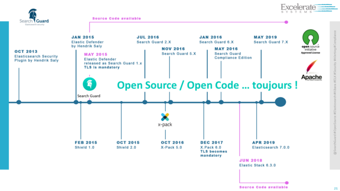

`</”Code never lies, comments sometimes do.” Ron Jeffries/>`

---
Nous avons appris que la société Elastic avait intenté un procès à Floragunn, dans le district nord de la Californie. Elastic prétend dans son annonce publique que floragunn GmbH a copié “des portions multiples et critiques du code source de sécurité propriétaire X-Pack d’Elastic dans son produit Search Guard”.

En outre, Elastic affirme qu’ ”il était nécessaire pour floragunn de décompiler intentionnellement ce code pour permettre la copie et la création d’œuvres dérivées”.

Floragunn ne voit aucun fondement à une quelconque violation des droits d’auteur, rejette vigoureusement toutes les accusations d’Elastic et a constamment nié ces accusations par le passé.

Le travail lié à Search Guard remonte à une époque où aucune solution de sécurité d’Elastic n’était disponible. Floragunn a consacré beaucoup de travail et d’efforts à Search Guard au fil des ans.

> Nous trouvons regrettable qu’Elastic ait eu recours à un procès contre Floragunn, un membre précieux de la communauté Elasticsearch.
Ce genre de comportement est en contradiction avec l’esprit de l’Open Source et nuit à la vitalité de la communauté.

Floragunn se défend vigoureusement pour préserver sa réputation, et prendra toutes les mesures juridiques et autres nécessaires pour contrer les accusations d’Elastic.

ils ont examiné les affirmations d’Elastic de manière très approfondie, et des experts indépendants ont également examiné le code source. Cette affaire est évidemment la tentative d’une grande entreprise publique de détruire un petit concurrent innovant en lançant de fausses accusations de violation des droits d’auteur.

**Le procès lui-même, ainsi que le travail de communication qui l’accompagne, est censé susciter la peur, le doute et l’incertitude chez nos utilisateurs et nos clients. Au lieu de concurrencer loyalement Search Guard, Elastic tente malheureusement de nuire à Floragunn avec un procès sans fondement.**

Tout récemment, AWS a annoncé la disponibilité de fonctions de sécurité avancées pour sa populaire distribution [Amazon Elasticsearch Services](https://aws.amazon.com/fr/elasticsearch-service/) et a publié la déclaration suivante à propos de Search Guard :
> “Les fonctions de sécurité incluses dans Open Distro pour Elasticsearch ont été extrêmement populaires, car le logiciel libre Elasticsearch manque même des fonctions de sécurité de base. Pour assurer la sécurité d’Open Distro for Elasticsearch, nous avons travaillé avec floragunn GmbH, une société spécialisée dans les logiciels de sécurité qui développe Search Guard, une alternative aux fonctions de sécurité commerciales d’Elastic. Nous voulons faire savoir à la communauté qu’AWS a effectué ses propres vérifications avant de s’associer à floragunn et n’a trouvé aucune preuve que Search Guard ait détourné du code protégé par des droits d’auteur. De plus, nous avons évalué l’ensemble du code spécifié par Elastic dans son litige, ainsi que nous avons engagé des experts tiers, et nous sommes convaincus que les affirmations d’Elastic sont sans fondement.”

[AWS a effectué sa propre vérification préalable avant de s’associer à Floragunn et n’a trouvé aucune preuve que Search Guard ait détourné du matériel protégé par des droits d’auteur ](https://aws.amazon.com/blogs/opensource/launching-open-distro-for-elasticsearch-security-features-on-amazon-elasticsearch-service/)

**Le Code est l’ADN de l’industrie du logiciel. L’éthique, la franchise, la transparence et l’intégrité en sont les facteurs de confiance.
Et vous, à qui faites-vous confiance pour protéger vos données ?**

>Traduit de [la publication originale](https://search-guard.com/search-guard-elastic/). 

